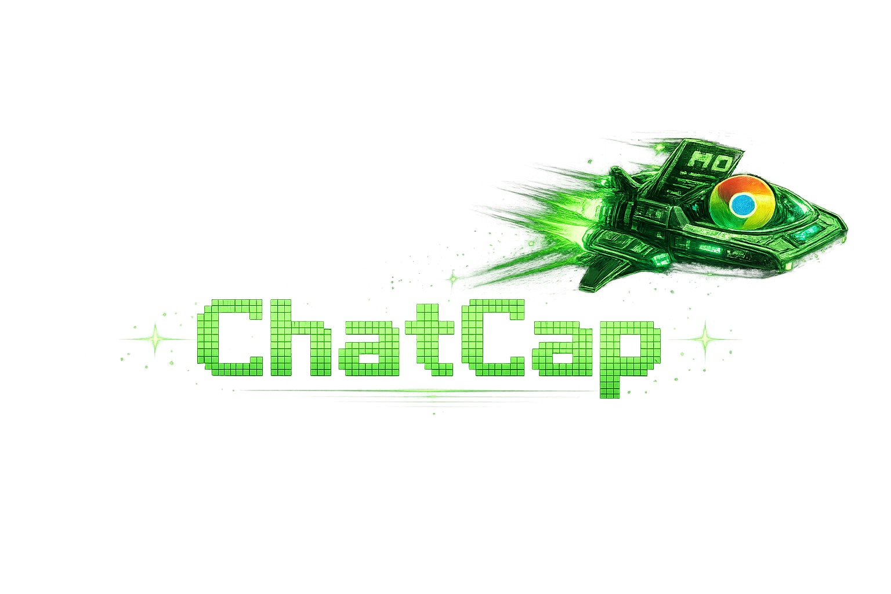
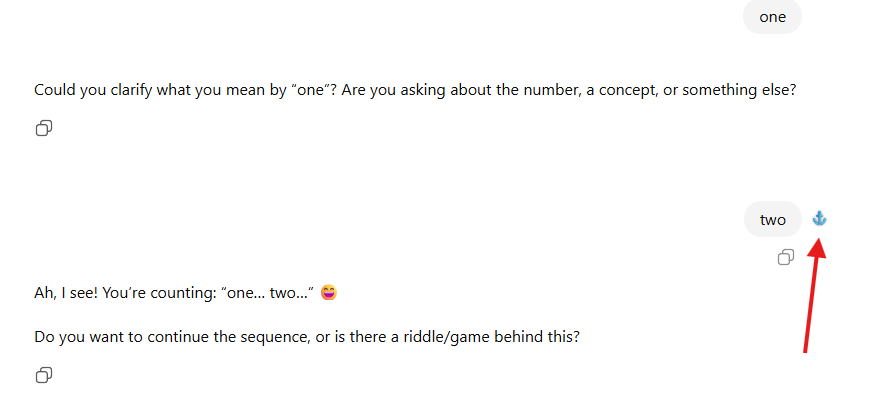
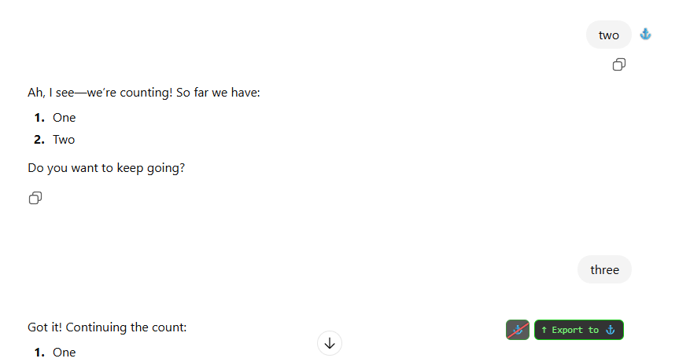
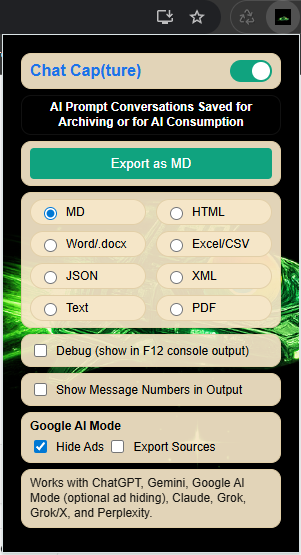

# ChatCap
### Turn Your AI Conversations into Reusable Export Assets



**ChatCap (Chat Capture) is a Chrome extension that transforms your live AI chat sessions (ChatGPT, Google AI Mode, Claude, Gemini, Grok, Grok/X, Perplexity) into clean, structured export files (MD/HTML/DOCX/CSV/JSON/XML/Text/PDF) — ready for Git, Codex, Claude Code, or any agentic workflow.**

Supported platforms:
- ChatGPT (chatgpt.com, chat.openai.com)
- Google AI Mode (google.com AI Mode in a standard web tab)
- Claude (claude.ai)
- Gemini (gemini.google.com, bard.google.com)
- Grok (grok.com, www.grok.com)
- Grok/X (x.com/i/grok, twitter.com/i/grok)
- Perplexity (perplexity.ai, www.perplexity.ai)

Supported export formats:
- Markdown (.md)
- HTML (.html)
- Word (.docx)
- Excel/CSV (.csv)
- Text (.txt)
- JSON (.json)
- XML (.xml)
- PDF (print dialog)

New: Grok support is live on `grok.com` and `www.grok.com`. Grok/X support is live on `x.com/i/grok` and `twitter.com/i/grok`.
New: Perplexity support is live on `perplexity.ai` and `www.perplexity.ai`.
Google AI Mode works when it loads on `https://www.google.com/` in a normal tab. If you are logged in and AI Mode appears inside a `chrome://` or `chrome-search://` page (often New Tab/Search), Chrome blocks extensions there and ChatCap cannot run.

Do your big-picture thinking in a browser tab, then transfer the work to Claude Code or Codex.

---

## Why ChatCap?

With ChatCap, you can save your conversations as properly formatted export files (MD/HTML/DOCX/CSV/JSON/XML/Text/PDF). The alternative is to select, copy, and paste conversations into files (not always trivial), or print as PDF (not ideal).

ChatCap makes saving and using conversations in other workflows easy.
You can combine conversations into one by exporting the files from each.
You can feed a conversation out of any supported platform into other AI systems.

If you use ChatGPT, Google AI Mode, Claude, Gemini, Grok, Grok/X, or Perplexity in the browser, you already know:

- You architect systems in it
- You debug complex code in it
- You refine prompts iteratively
- You discover insights mid-session
- Your chat session becomes a notebook
- You make new discoveries that spur on new questions (often in one session)

You do this through iterative prompts, like a conversation — which we label as generative AI.
Generative AI is not a self-running agent that executes steps unassisted and builds a final product with unit tests.

---

## Generative AI vs Agentic AI

### Generative AI
From *generate* — to produce.

Generative AI systems (ChatGPT, Claude, Gemini, Copilot in chat mode) produce text, code, and ideas in response to prompts.

They think **with you**. You can move from planning in ChatGPT to execution in Claude Code (an agentic AI system).

---

### Agentic AI
From *agent*, with *ic* added to the end — acting as an agent.

Agentic AI systems are like assistants that do tasks for you, without your help, and report back when finished.

Examples of agentic AI systems are Codex, Claude Code, or local coding agents.
These take structured input (like a prompt or an .md file, or the output of another program) and operate autonomously,
doing such tasks:

- Modifying files
- Traversing repositories
- Executing multi-step tasks
- Applying reasoning over projects

They work for you.

---

ChatCap bridges the two.

It turns conversation into structured input for AI tools that act. Or it lets you combine conversations to form a new one.

---

# Features

- Hover-based export controls (up/down) plus anchor mode (Export to anchor)
- One-click full session export — save part or all of your chat session to a single file
- Clean Markdown formatting — .md files are plain text
- Export formats from the popup: MD, HTML, DOCX, CSV, Text, JSON, XML, or PDF (via print dialog)
- Image/attachment export (ZIP) when images are present
- Debug mode with kinds/levels; logs include kind + caller and are visible in the page console
- Role segmentation (User / Assistant) in the output
- Optional message numbering in all outputs
- Licensing with paid/unpaid mode (unpaid exports are limited to the first 3 messages)
- Google AI Mode: optional Hide Ads toggle + Export Sources toggle (skip source blocks when off)
- Hidden elements (display:none/aria-hidden/hidden) are stripped from exports
- Master On/Off switch to disable injection and logging
- Preserves code blocks by converting to Markdown fences
- Preserves tables and math/LaTeX with high fidelity
- Local-only processing (no external servers)
- Chrome Manifest V3 compatible
- Platforms supported: ChatGPT, Google AI Mode, Claude, Gemini, Grok, Grok/X, Perplexity

---

# Platform Notes

- ChatGPT: `chatgpt.com` and `chat.openai.com`
- Google AI Mode: `google.com` AI Mode in a standard web tab. If AI Mode is rendered inside a `chrome://` or `chrome-search://` surface (common when logged in on New Tab/Search), Chrome blocks content scripts, so ChatCap cannot inject there.
- Claude: `claude.ai`
- Gemini: `gemini.google.com` and `bard.google.com`
- Grok: `grok.com` and `www.grok.com`
- Grok/X: `x.com/i/grok` and `twitter.com/i/grok`
- Perplexity: `perplexity.ai` and `www.perplexity.ai`

---

# Usage

## Unanchored Mode


Three choices:
1. You can set an anchor by pressing the anchor sign.
2. You can export everything from this session, up all the way to the first conversation prompt.
3. You can export everything from this point down to the very bottom of the conversation.

---

## Anchor Mode



When the anchor is set, your options change to:


You can also clear the anchor this way (or by pressing on an anchor that is already set).



---

## Export Formats

You can export to any file format shown on the main dialog:



Notes:
- CSV is Excel-friendly: one row per message, with role and range columns.
- PDF uses the browser print dialog. If you choose a cloud or network printer/service, the content leaves your machine. Save as PDF keeps it local.
- If images/attachments are detected, ChatCap will ask whether to export as a ZIP. If you choose ZIP, the download contains your main export file plus an `assets/` folder with the images. Links inside the export are rewritten to point to those local files.
- If image fetch fails and screenshot fallback needs extra permission, ChatCap will prompt you to click the ChatCap extension icon once, then retry export.

---

## Licensing

ChatCap validates licenses by contacting the Sys1000 license server. Only your license key, email, and a local device ID are sent for validation. Chat content is not sent to the licensing server.
Unpaid mode limits exports to the first 3 messages (from the top). The Register panel hides once a license is active.
After purchase, the license key is shown on the success page (session-id based) and can also be emailed if configured.
The Buy button can display the live price by querying the license server.

---

# Chrome Extension Installation

1. Download this repo (for example: `c:\repos\ChatCap`)
2. Open Chrome and navigate to:

   `chrome://extensions`

3. Enable **Developer Mode**
4. Click **Load Unpacked**
5. Select:

   `c:\repos\ChatCap`

6. Pin ChatCap to your toolbar

---

# Project Structure

```
ChatCap/
  icons/
  assets/
  content/
  manifest.json
  popup.html
  popup.js
```

---

# Technical Details

For those interested in how it works:

### DOM Extraction
ChatCap uses platform-specific selectors to find message nodes for ChatGPT, Google AI Mode, Claude, Gemini, Grok, Grok/X, and Perplexity. This ensures compatibility with lazily rendered conversation turns across different UIs.

Google AI Mode is scoped to the AI conversation container to avoid capturing search results, sidebar cards, or ads.
Hidden elements are stripped during export so invisible UI or policy text does not leak into the output.
When Export Sources is off, Google AI Mode source blocks (and their embedded images) are removed from the MD export.
If AI Mode is hosted on a `chrome://` or `chrome-search://` page (often when logged in on New Tab/Search), Chrome blocks extensions from injecting, so ChatCap will not run in that surface.

The popup uses the content script to return a structured message list and then
serializes it into the selected format (MD/HTML/DOCX/CSV/Text/JSON/XML/PDF).

---

### Role Segmentation
Messages are automatically labeled as:
- User
- Assistant
- System (if present in DOM)
- Tool

Each export is structured with Markdown headers:
```
## User (Message N)
## Assistant (Message N)
```

---

### Code Preservation
`<pre><code>` blocks are converted into fenced Markdown blocks:

```python
# Example preserved code block
```

Inline `<code>` is wrapped in backticks.

---

### Table and Math/LaTeX Preservation
Tables are converted into Markdown table syntax. Math/LaTeX is preserved using standard `$...$` and `$$...$$` delimiters so editors like VS Code render properly.

---

### Clean Export
UI elements (buttons, copy controls, share links) are stripped during cloning of the message node to ensure clean output.

---

### Security Model
- No chat content leaves your browser. Assets are fetched directly from their source URLs when you choose ZIP export.
- License validation contacts the Sys1000 license server with key + email + device ID (no chat content).
- No data leaves your browser unless you explicitly choose a cloud or network print destination for PDF.
- Uses Chrome content scripts only
- Operates on the currently open thread only

---

# License

Not for resale in any company; individuals can use it freely as is.


